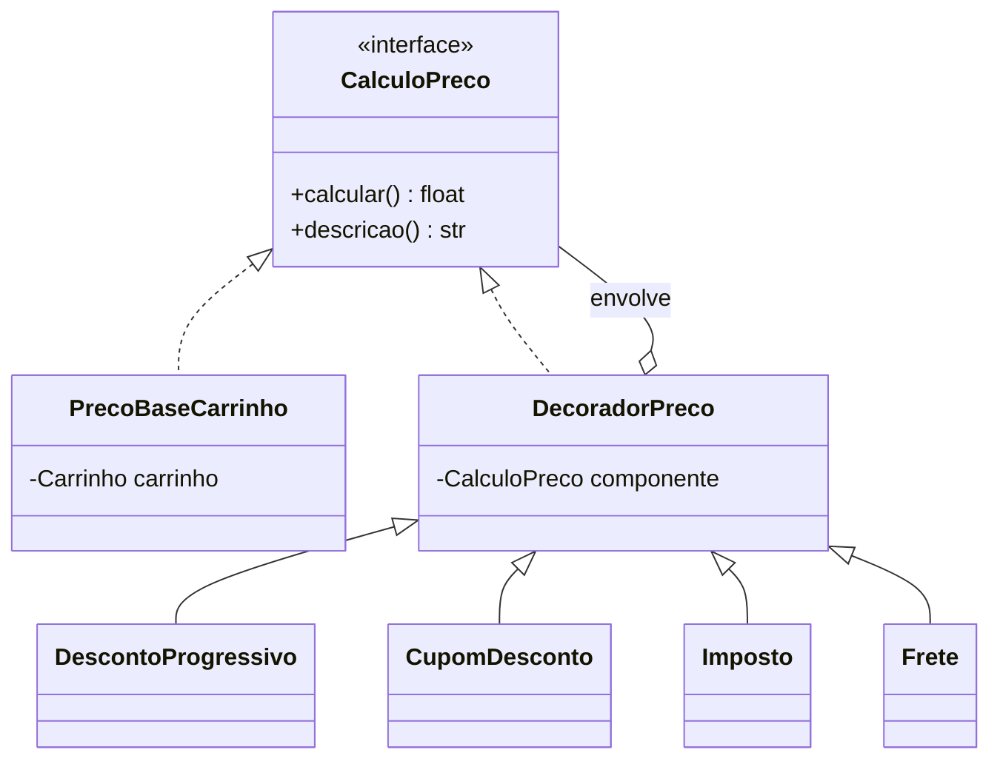
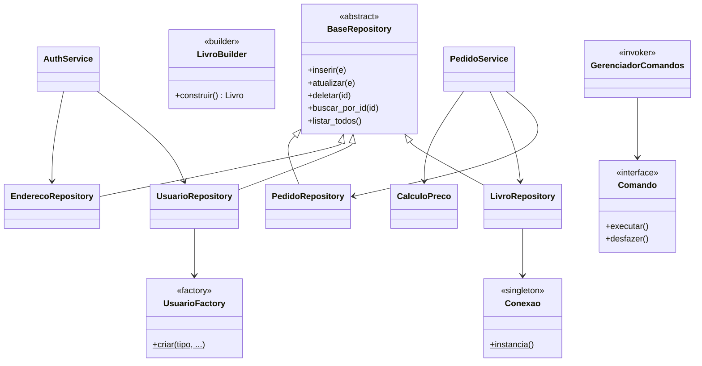

# Diagrama de Classes — Alexandria

O diagrama abaixo está em [Mermaid](https://mermaid.js.org/) e é renderizado
automaticamente pelo GitHub. Ele destaca as entidades de domínio, os
relacionamentos (1:1 e 1:n) e os principais padrões de projeto.

## Entidades e relacionamentos

```mermaid
classDiagram
    class Usuario {
        +int id
        +str nome
        +str email
        +str senha
        +str telefone
        +str cpf
        +str tipo_acesso
        +eh_admin() bool
    }
    class Cliente
    class Administrador
    class Endereco {
        +int id
        +str rua
        +str cep
        +int usuario_id
    }
    class Livro {
        +int id
        +str titulo
        +str autor
        +float preco
        +int estoque
        +baixar_estoque(qtd)
    }
    class Pedido {
        +int id
        +int usuario_id
        +float total
        +str data
        +list~ItemPedido~ itens
    }
    class ItemPedido {
        +int livro_id
        +int quantidade
        +float preco_unitario
        +subtotal() float
    }
    class Carrinho {
        +adicionar(livro)
        +subtotal() float
    }
    class ItemCarrinho

    Usuario <|-- Cliente
    Usuario <|-- Administrador
    Usuario "1" --> "1" Endereco : possui (1:1)
    Usuario "1" --> "0..*" Pedido : faz (1:n)
    Pedido "1" *-- "0..*" ItemPedido : contém (1:n)
    ItemPedido "0..*" --> "1" Livro : referencia
    Carrinho "1" *-- "0..*" ItemCarrinho
    ItemCarrinho "0..*" --> "1" Livro
```

## Padrão Decorator (preço do pedido)



## Camadas e demais padrões


