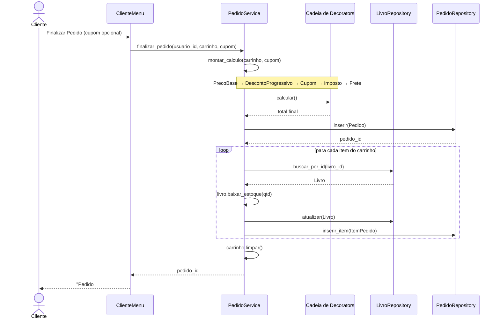
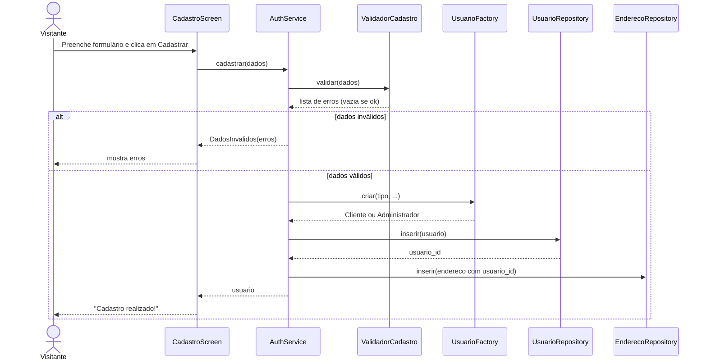
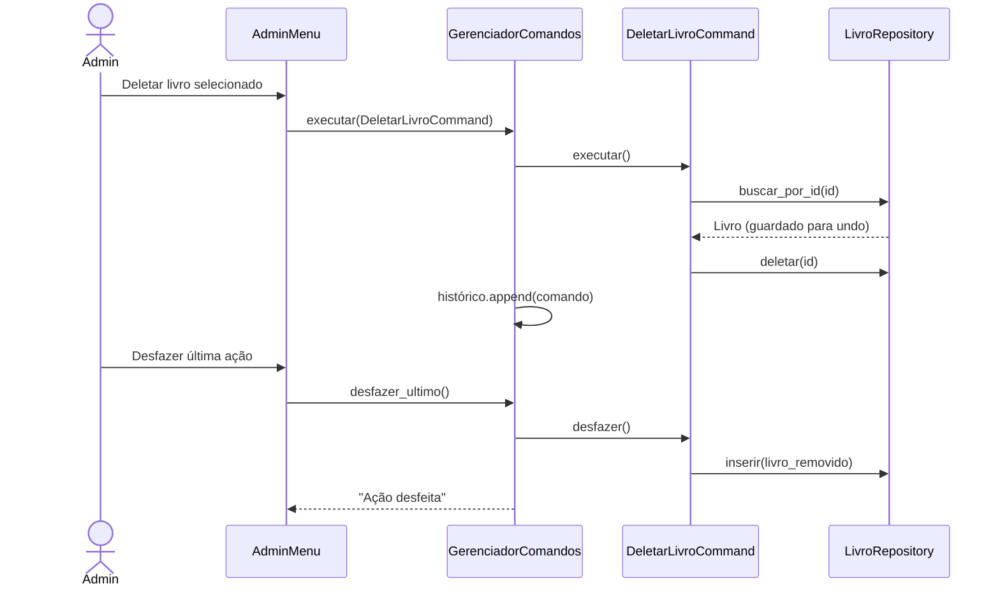

# Diagramas de Sequência — Alexandria

Diagramas em [Mermaid](https://mermaid.js.org/) (renderizados pelo GitHub).

## 1. Finalizar pedido (Decorator + relacionamento 1:n)

Mostra como o `PedidoService` monta **automaticamente** a cadeia de Decorators
para calcular o preço final e persiste o pedido e seus itens.

## 2. Cadastro de usuário + endereço (relacionamento 1:1, Factory, Strategy)

## 3. Admin: deletar livro com Undo (Command)

